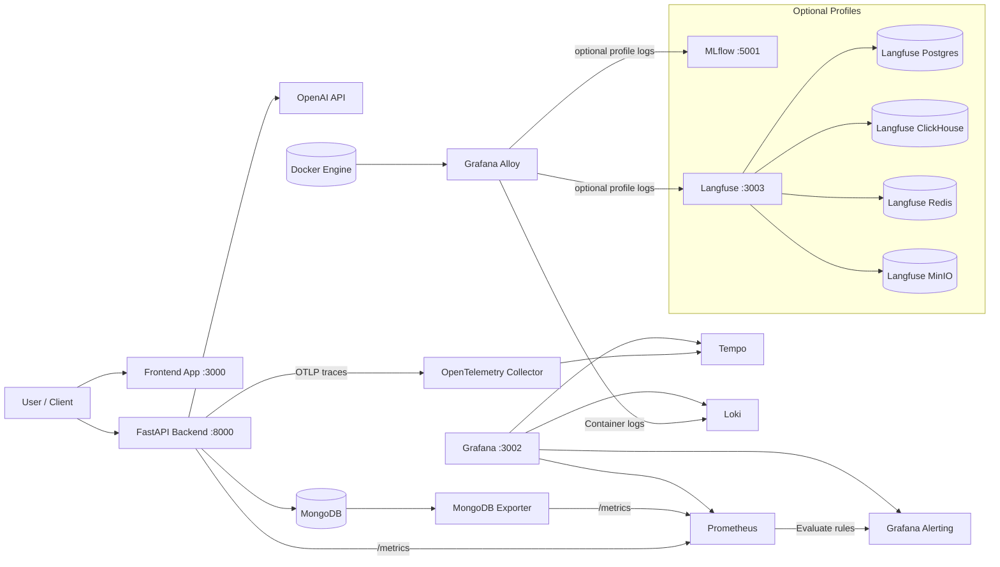
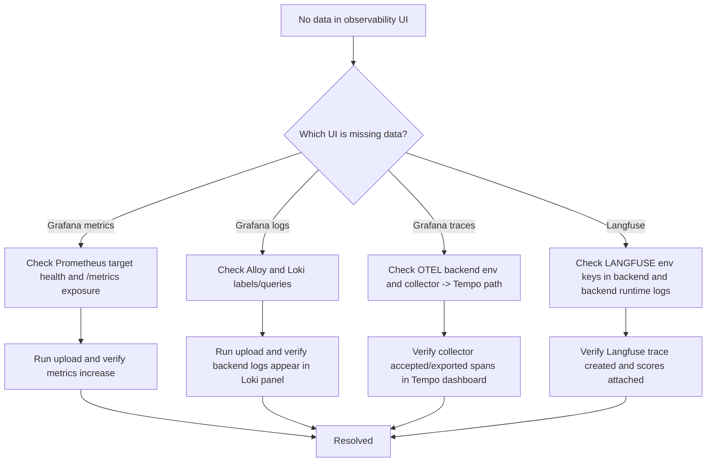
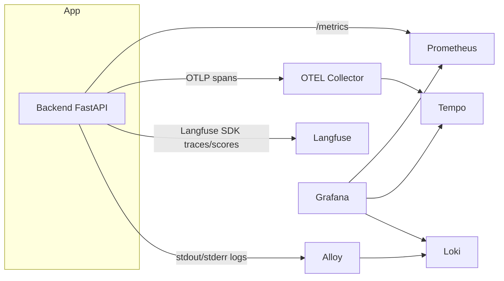

# Invoice Processing with LangChain

## Blog Post

Read the full article on DEV Community:

- [Extract Invoice Data Automatically Using LangChain](https://dev.to/aws-builders/extract-invoice-data-automatically-using-langchain-ga7)

## Demo Video

- [Watch the demo on YouTube](https://www.youtube.com/watch?v=lCVW4B7hKCc)

This project uses LangChain and OpenAI's GPT-4 Vision to process invoice images and extract structured data in JSON format.

## Features

- Process invoice images (JPG, JPEG, PNG)
- Extract structured data including:
- Invoice number and dates
- Vendor and customer information
- Line items with quantities and prices
- Totals, taxes, and payment terms
- Output structured JSON data
- Batch processing of multiple invoices

## Setup

1. Create a virtual environment:

```bash
python -m venv venv
source venv/bin/activate  # On Windows, use `venv\Scripts\activate`
```

1. Install dependencies:

```bash
pip install -r requirements.txt
```

1. Create a local `.env` file from `.env.example` and fill in real secrets (do not commit `.env`):

```bash
cp .env.example .env
```

Then set your real values, including OpenAI/MongoDB/Grafana credentials.

Example:

```dotenv
OPENAI_API_KEY=your_api_key_here
```

## Project Structure

- `src/`: Source code directory
- `main.py`: Main script for processing invoices
- `invoice_processor.py`: Invoice processing logic
- `invoice_schema.py`: JSON schema for invoice data
- `tests/`: Test files directory
- `invoices/`: Directory for invoice images to process
- `output/`: Directory for processed JSON results
- `requirements.txt`: Project dependencies
- `.env`: Environment variables (not tracked in git)

## Usage

1. Place your invoice images (JPG, JPEG, or PNG) in the `invoices` directory.

1. Run the processing script:

```bash
python src/main.py
```

1. Check the `output` directory for the processed JSON files.

## JSON Schema

The extracted data follows this structure:

```json
{
  "invoice_number": "string",
  "date": "YYYY-MM-DD",
  "vendor": {
    "name": "string",
    "address": "string",
    "contact": "string"
  },
  "customer": {
    "name": "string",
    "address": "string",
    "contact": "string"
  },
  "items": [
    {
      "description": "string",
      "quantity": "number",
      "unit_price": "number",
      "total": "number"
    }
  ],
  "subtotal": "number",
  "tax": "number",
  "total": "number",
  "currency": "string",
  "payment_terms": "string"
}
```

## Notes

- The system uses GPT-4 Vision to analyze invoice images
- Requires a valid OpenAI API key with access to GPT-4 Vision
- Processing time may vary depending on image size and complexity
- For best results, ensure invoice images are clear and well-lit

## Open Source Monitoring

This project supports OpenTelemetry-based tracing without requiring Langfuse.

Environment variables:

- `OTEL_ENABLED=true`
- `OTEL_SERVICE_NAME=invoice-backend`
- `OTEL_EXPORTER_OTLP_ENDPOINT=http://localhost:4317`
- `OTEL_EXPORTER_OTLP_INSECURE=true`

With these values set, FastAPI requests are traced and exported via OTLP/gRPC.
You can send traces to open-source backends such as Grafana Tempo, Jaeger, or SigNoz.

This repository now includes a monitoring overlay compose file at `docker-compose.monitoring.yml`.

Start core observability stack (Grafana, Prometheus, Loki, Tempo, OTel Collector, Alloy):

```bash
docker compose -f docker-compose.yml -f docker-compose.monitoring.yml up -d
```

Enable optional MLflow tracking UI:

```bash
docker compose -f docker-compose.yml -f docker-compose.monitoring.yml --profile mlflow up -d
```

Enable optional Langfuse stack:

```bash
docker compose -f docker-compose.yml -f docker-compose.monitoring.yml --profile langfuse up -d
```

If the Python app runs on your host machine, use `LANGFUSE_HOST=http://127.0.0.1:3003`.
If the Python app runs in the `backend` container, use `LANGFUSE_HOST=http://langfuse:3000`.

Useful endpoints:

- Grafana: `http://localhost:3002` (admin/admin)
- Prometheus: `http://localhost:9090`
- Loki API: `http://localhost:3100`
- Tempo API: `http://localhost:3200`
- MLflow (profile): `http://localhost:5001`
- Langfuse (profile): `http://localhost:3003`

Prebuilt dashboards are auto-provisioned in Grafana under folder `Invoice Backend`:

- `Invoice Backend - Prometheus Overview`
- `Invoice Backend - Loki Logs`
- `Invoice Backend - Tempo Traces`
- `Invoice Backend - AI Workload`
- `Invoice Backend - MongoDB Overview`
- `Invoice Backend - AI Platform Logs`
- `Invoice Backend - App Use Cases`

Note on traces: the Tempo dashboard includes trace pipeline health/throughput panels. Full trace drill-down is done in Grafana Explore using the Tempo datasource.

Baseline alert rules are also provisioned in Grafana folder `Invoice Backend`:

- `Backend Down`
- `High 5xx Error Rate`
- `AI Error Rate High`
- `AI p95 Latency High`
- `MongoDB Exporter Down`
- `MongoDB Connections High`

If Grafana is already running, reload to pick up new dashboards:

```bash
docker compose -f docker-compose.yml -f docker-compose.monitoring.yml up -d --force-recreate grafana
```

Alert rules are loaded from:

- `monitoring/grafana/provisioning/alerting/invoice-alert-rules.yml`

## Current Stack

### Application Layer

- FastAPI backend (Python)
- LangChain + OpenAI model integration for invoice extraction
- MongoDB for metadata and invoice result storage

### Observability Layer

- OpenTelemetry SDK in backend (`src/core/observability.py`)
- OpenTelemetry Collector for telemetry routing
- Grafana Tempo for traces
- Prometheus for metrics
- Grafana Loki for logs
- Grafana Alloy for Docker log collection and forwarding
- Grafana for dashboards and correlation

### Optional AI Product Observability

- Langfuse for prompt/trace/token/cost analytics (profile: `langfuse`)
- MLflow tracking server for experiment/run logging (profile: `mlflow`)

### AI Workload Metrics

The backend now emits AI-specific Prometheus metrics from the LangChain invoice flow:

- `ai_requests_total{model,status}`
- `ai_errors_total{model,error_type}`
- `ai_tokens_total{model,token_type}` where `token_type` is `prompt`, `completion`, or `total`
- `ai_request_duration_seconds{model,status}`
- `ai_tokens_per_request{model,status}`
- `ai_cost_usd_total{model}` (estimated from token prices)
- `ai_parse_failures_total{model,reason}`

Optional cost model env vars (defaults are set for `gpt-4o`):

- `AI_PRICE_GPT4O_INPUT_PER_1M`
- `AI_PRICE_GPT4O_OUTPUT_PER_1M`

Suggested PromQL queries for Grafana panels:

```promql
sum(increase(ai_tokens_total{token_type="total"}[1h])) by (model)
```

```promql
sum(rate(ai_requests_total{status="success"}[5m])) by (model)
```

```promql
sum(rate(ai_errors_total[5m])) by (model, error_type)
```

```promql
histogram_quantile(0.95, sum(rate(ai_request_duration_seconds_bucket[5m])) by (le, model))
```

### Application Use-Case Metrics

The backend now emits route and business workflow metrics for end-to-end workload visibility:

- `app_route_requests_total{route,method,status_class}`
- `app_route_request_duration_seconds{route,method,status_class}`
- `invoice_processing_total{stage,status,file_type}`
- `invoice_processing_duration_seconds{stage,status,file_type}`
- `supplier_match_total{status}`
- `supplier_match_items_total{match}`

### MongoDB Metrics

MongoDB is now scraped through `mongodb-exporter` and visualized in Grafana.

Key metrics include:

- `mongodb_up`
- `mongodb_ss_connections`
- `mongodb_ss_opcounters`
- `mongodb_ss_mem_resident_mb`

### Runtime / Delivery

- Docker Compose (`docker-compose.yml` + `docker-compose.monitoring.yml`)
- Local secret management through `.env` (gitignored) and `.env.example`

## Architecture Diagram



## Observability Source Map

Use this as the single source of truth for where each signal comes from.

| What you see | Primary UI | Data source/backend | How it is produced |
| --- | --- | --- | --- |
| API request rate, latency, error %, process/mongo stats, AI token/cost counters | Grafana dashboards | Prometheus | Backend `/metrics`, mongodb-exporter, collector metrics |
| Application and platform logs | Grafana dashboards | Loki | Docker logs forwarded by Alloy |
| Distributed traces for backend requests | Grafana Explore/Tempo dashboard | Tempo | OTEL spans exported from backend -> OTEL collector -> Tempo |
| AI traces, users, sessions, scores (`invoice_parse_valid`, `totals_consistency`, etc.) | Langfuse UI | Langfuse | Langfuse SDK calls from backend |

Important distinction:

- OTEL is the telemetry instrumentation/pipeline.
- Tempo is the trace storage and query backend used by Grafana.
- Langfuse is a separate AI observability system (trace semantics, user/session context, quality scoring).

## Dashboard Data Source Legend

Each provisioned Grafana dashboard now contains a `Data Source Legend` text panel that states:

- whether panels come from Prometheus, Loki, or Tempo
- that Langfuse traces/scores are viewed in Langfuse UI

Dashboards updated with legend panel:

- `Invoice Backend - Prometheus Overview`
- `Invoice Backend - Loki Logs`
- `Invoice Backend - Tempo Traces`
- `Invoice Backend - MongoDB Overview`
- `Invoice Backend - AI Workload`
- `Invoice Backend - App Use Cases`
- `Invoice Backend - AI Platform Logs`

## End-to-End Validation Runbook

Use this exact flow after deployment changes.

1. Start stack

```bash
docker compose -f docker-compose.yml -f docker-compose.monitoring.yml --profile langfuse up -d
```

1. Rebuild backend when code or dependencies change

```bash
docker compose -f docker-compose.yml -f docker-compose.monitoring.yml --profile langfuse up -d --build --force-recreate backend
```

1. Verify backend Langfuse env wiring

```bash
docker compose -f docker-compose.yml -f docker-compose.monitoring.yml --profile langfuse exec -T backend /bin/sh -lc "env | grep '^LANGFUSE'"
```

1. Trigger one invoice upload (`POST /upload`).

1. Confirm backend logs

- `Langfuse enabled`
- no traceback during upload

1. Confirm in UIs

- Grafana: metrics/logs/trace pipeline panels update
- Langfuse: new `invoice-extraction` trace appears with scores and metadata

### Expected Langfuse Scores

- `invoice_parse_valid`
- `invoice_extraction_success`
- `totals_consistency`
- `required_fields_completeness`
- `pii_redaction_applied`

## Troubleshooting Flow



## Runtime Data Paths



## Notes for Operators

- The old import check `from langfuse.langchain import CallbackHandler` is not required for this implementation.
- Current backend integration uses direct Langfuse SDK APIs with compatibility fallbacks for older/newer SDK variants.
- Keep real secrets only in local/server `.env`; never commit them.

## Monitoring Stack Summary

- FastAPI app metrics via `/metrics` endpoint
- AI workload metrics from LangChain flow (`ai_requests_total`, `ai_errors_total`, token and latency metrics)
- OpenTelemetry traces from backend to Tempo through OTel Collector
- Container logs from Docker to Loki via Grafana Alloy
- MongoDB internal metrics via mongodb-exporter to Prometheus
- Grafana dashboards for backend, AI workload, traces, logs, MongoDB, and AI platform logs
- Grafana-managed alert rules for availability, error rate, latency, and MongoDB health
- Optional profiles:
- `mlflow` for experiment tracking
- `langfuse` for AI product observability stack

## Public Repository Security Notes

- Do not commit real secrets (API keys, DB passwords, tokens) into tracked files.
- Keep real values only in local `.env` (already gitignored).
- Use `.env.example` as a template with placeholder values only.
- Rotate any credential that was previously committed.
- Restrict database/network exposure in production (prefer internal network access only).

## Production Readiness Checklist

This repository is great for learning and can be evolved toward production.

Recommended hardening steps:

- Replace all placeholder secrets in local `.env` with strong values.
- Remove public host port exposure for internal services in production (`mongodb`, `loki`, `tempo`, `prometheus`, `minio`) unless required.
- Add persistent backups for MongoDB, Grafana, Prometheus, Loki, and Langfuse stores.
- Configure Grafana contact points and notification policies (Slack, email, PagerDuty, or webhook).
- Add TLS and authentication in front of Grafana, Prometheus, and MLflow if they are externally reachable.
- Use managed object storage (or hardened MinIO) for Langfuse artifacts.
- Set resource limits/requests and retention policies per component.
- Add synthetic checks and business-level SLIs for critical invoice APIs.

## Run Test

```bash
python -m unittest discover -s .
```
